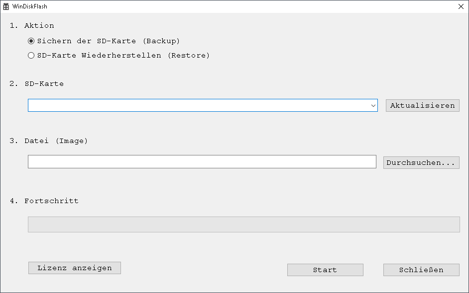

# DiskCloner

## About

DiskCloner is a tool for easily read or write raw disk images (aka `dd` images) under Windows.

## Features

* Easy usage
* Read disks into images or save images to disks.
* Safety - ensures correct target device - unlike other tools
* Works on Windows XP+ out of the box
* Shows time remaining 

## Download

[Latest release](https://github.com/ssibitz/DiskCloner/releases/latest/download/DiskCloner.exe)

## Screenshot

## Building

### Requirements

* Visual Studio 2019 (maybe 2017 works too)
* MSVC v141 - VS 2017 C++ build tools
* C++ Windows XP Support for VS 2017 (v141) tools

### Compiling

1. Open DiskCloner.sln
2. Build

## Translation

Look into DiskCloner/DiskCloner.rc, strings in the STRINGTABLE record are needed to be translated. 
If you have enough development knowledge send a PR, otherwise post an Issue. Thanks for making DiskCloner better.

## License

All files are licensed under the following license, unless explicitly stated otherwise in the file:

	Copyright 2024 by Stefan Sibitz
	DiskCloner - Disk image flasher
	
	DiskCloner is free software: you can redistribute it and/or modify
	it under the terms of the GNU General Public License as published by
	the Free Software Foundation, either version 3 of the License, or
	(at your option) any later version.
	
	DiskCloner is distributed in the hope that it will be useful,
	but WITHOUT ANY WARRANTY; without even the implied warranty of
	MERCHANTABILITY or FITNESS FOR A PARTICULAR PURPOSE.  See the
	GNU General Public License for more details.
	
	You should have received a copy of the GNU General Public License
	along with DiskCloner.  If not, see <https://www.gnu.org/licenses/>.